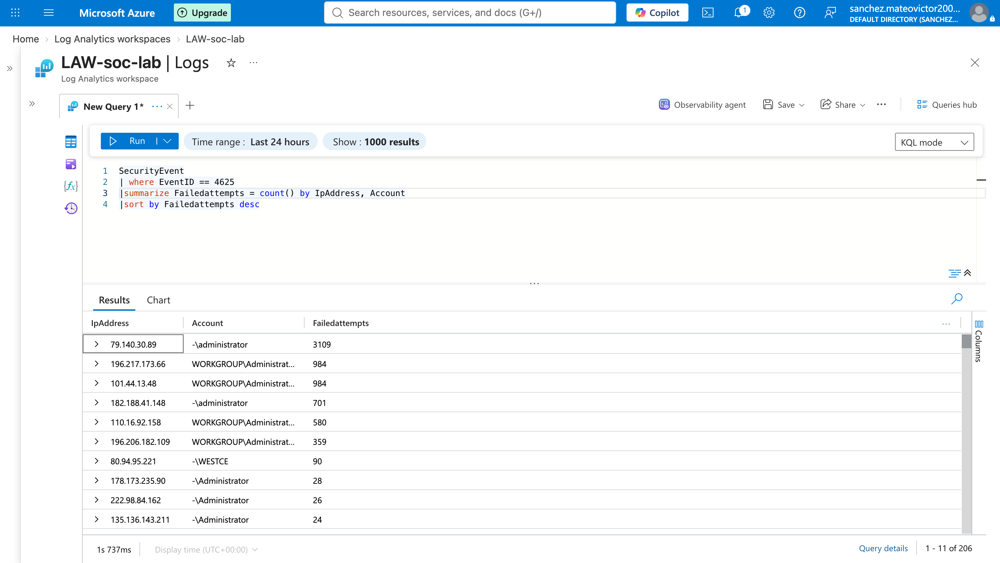

# Microsoft-Sentinel-SOC-LAB
Hands on SOC Lab using Microsoft Azure, Log Analytics, KQL, and Windows Security Events to detect and investigate brute force, powershell, account creation, privilege escalation, and persistence activity.
## Project Overview

In this lab, I deployed a Windows virtual machine in Microsoft Azure and connected it to a Log Analytics workspace for centralized security monitoring.

I used Windows Security Event logs and Kusto Query Language (KQL) to investigate authentication activity, PowerShell execution, account creation, privilege escalation, and persistence-related behavior.

The goal of this project is to simulate the investigation workflow of a Tier 1 SOC Analyst by reviewing logs, identifying suspicious activity, writing detection queries, and documenting findings.

## Project Screenshot



## Technologies Used

- Microsoft Azure

- Microsoft Sentinel

- Log Analytics Workspace

- Windows Virtual Machine

- Windows Security Event Logs

- Azure Monitor Agent

- Kusto Query Language (KQL)

- PowerShell
  
## Detections Investigated

- Brute Force Authentication — Event ID 4625

- Suspicious PowerShell Execution — Event ID 4688

- New User Account Creation — Event ID 4720

- Privileged Group Membership Change — Event ID 4732

- Scheduled Task Persistence — Event ID 4698

## Investigation Reports

- [Brute Force Investigation](incidents/brute-force-investigation.md)
- [Suspicious PowerShell Investigation](incidents/powershell-investigation.md)
- [New User Account Creation Investigation](incidents/account-creation-investigation.md)
- [Privileged Group Membership Investigation](incidents/privileged-group-membership-investigation.md)
- [Scheduled Task Persistence Investigation](incidents/scheduled-task-persistence-investigation.md)

## Detection Documentation

- [Brute Force Detection](detections/brute-force-detection.md)
- [PowerShell Detection](detections/powershell-detection.md)
- [Account Creation Detection](detections/account-creation-detection.md)
- [Privileged Group Membership Detection](detections/privileged-group-membership-detection.md)
- [Scheduled Task Persistence Detection](detections/scheduled-task-persistence-detection.md)

## Skills Demonstrated

- SIEM investigation

- Microsoft Sentinel

- Azure Log Analytics

- KQL querying

- Windows Event ID analysis

- Brute-force detection

- PowerShell analysis

- Privilege escalation detection

- Persistence detection

- SOC documentation

## Repository Structure

```text

Microsoft-Sentinel-SOC-LAB/

├── detections/

├── docs/

├── incidents/

├── queries/

├── report/

├── screenshots/

└── README.md
```

## Disclaimer

This project was performed in a controlled lab environment for cybersecurity education and SOC analyst training.
