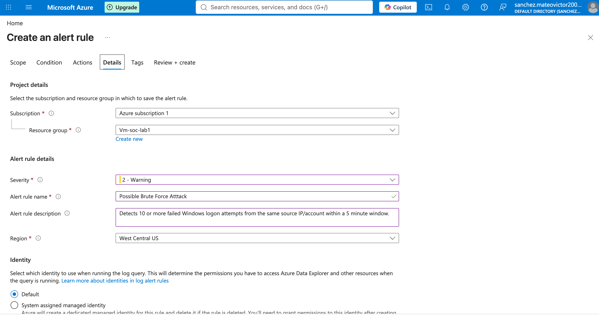

# Brute Force Authentication Detection

## Event ID

`4625` — Failed Logon

## Objective

Identify repeated failed Windows logon attempts that may indicate brute-force activity.

## KQL Query

```kql
SecurityEvent
| where EventID == 4625
| summarize FailedAttempts = count() by IpAddress, Account
| sort by FailedAttempts desc
```
## Findings

The query showed repeated failed authentication attempts against Administrator-related accounts from multiple external IP addresses.

One source IP generated more than 3,000 failed logon attempts, which is highly suspicious and consistent with automated brute-force activity.

## Investigation Details

I reviewed the timing and characteristics of the failed authentication activity to determine whether the behavior was isolated or repeated over time.

A first-seen and last-seen query showed sustained failed authentication attempts from multiple source IP addresses. One source generated thousands of failed logon attempts during the observed period.

Detailed Event ID 4625 records showed LogonType 3, indicating network logon attempts. The events also included failure reason, status, and substatus fields that helped confirm repeated unsuccessful authentication activity.

## IP Enrichment

I investigated one of the high-volume source IP addresses, `79.140.30.89`.

The IP lookup identified the address as associated with JSC Ufanet and geolocated it to Ufa, Russian Federation.

IP geolocation alone does not prove malicious intent, but it provided additional context during the investigation.

## Detection Logic

To identify concentrated failed login activity within a short time window, I used:

```kql
SecurityEvent
| where EventID == 4625
| summarize FailedAttempts = count() by IpAddress, Account, bin(TimeGenerated, 5m)
| where FailedAttempts >= 10
```
This flags cases where the same source IP and account combination has 10 or more failed logon attempts within five minutes.

## Alert Rule Configuration

I configured the settings for a custom log search alert named `Possible Brute Force Attack`.

The alert logic was designed to identify 10 or more failed Windows logon attempts from the same source IP and account within a five-minute window.

**Severity:** Warning



## Analyst Assessment

The volume and repetition of failed logon attempts indicate likely automated credential guessing against the exposed Windows system.

## Recommended Response

 Review the targeted account.

 Investigate the source IP address.

 Confirm whether any successful logons followed the failed attempts.

 Restrict unnecessary remote access.

 Enforce strong passwords and account lockout controls.


