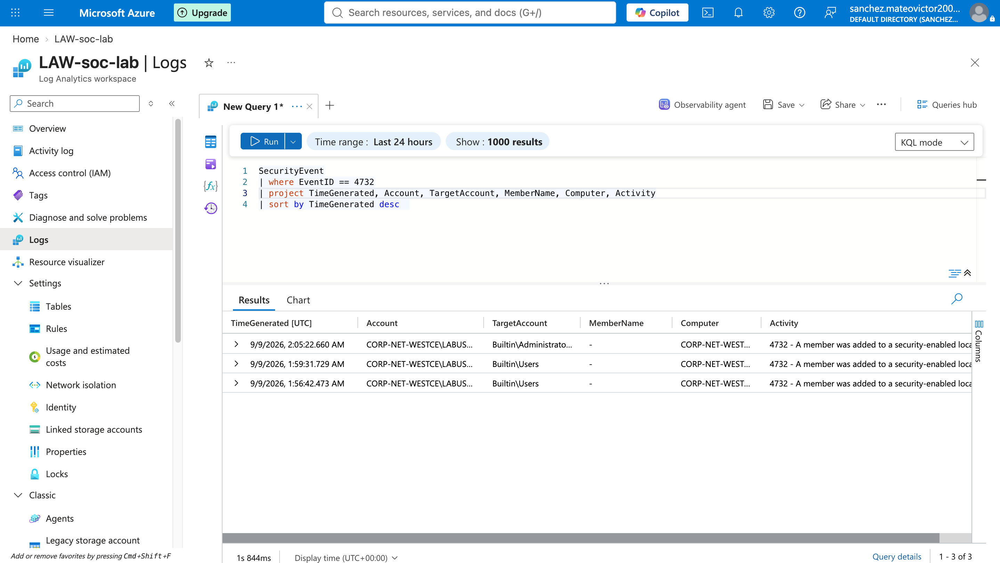

# Privileged Group Membership Change Detection

## Event ID

`4732` = A Member Was Added to a Security Enabled Local Group

## Objective

Identify changes to local security group membership that may indicate privilege escalation or unauthorized administrative access.

## KQL Query

```kql
SecurityEvent
| where EventID == 4732
| project TimeGenerated, Account, TargetAccount, MemberName, Computer, Activity
| sort by TimeGenerated desc
```

## Findings

The query returned local security group membership change events.
The results showed membership changes involving local groups including Builtin\Users and Builtin\Administrators.
The events included the account that performed the action, the target group, the affected computer, and the Windows activity description.



## Analyst Assessment

Changes to privileged local groups can be legitimate administrative activity, but unexpected additions to groups such as Builtin\Administrators may indicate privilege escalation or unauthorized access.
The events should be reviewed to determine whether the membership changes were expected and authorized.

## Recommended Response

Verify which account performed the group membership change.

Confirm whether the change was authorized.

Review the account or member added to the group.

Check for related account creation or administrative activity around the same timestamp.

Remove unauthorized privileged group membership if confirmed.
