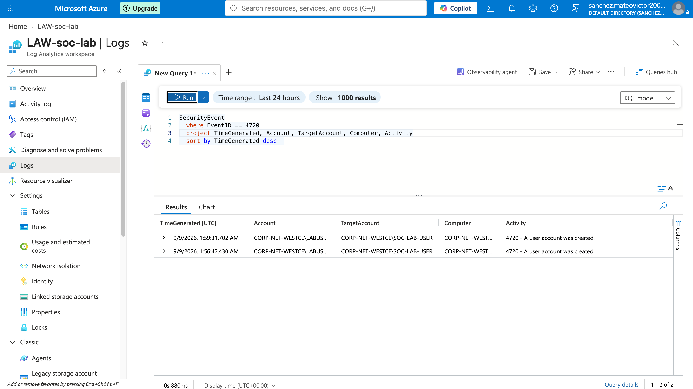

# New User Account Creation Investigation

## Detection

Windows user account creation activity Event ID `4720`

## Summary

A new Windows user account named `SOC-LAB-USER` was identified through Security Event logging.

New account creation can be legitimate administrative activity, but unexpected account creation may indicate unauthorized access or persistence and should be investigated.

## Investigation

I reviewed Windows account creation events using Microsoft Azure Log Analytics and KQL.

The investigation included:

- Filtering for Event ID 4720.
- Identifying the account that performed the action.
- Reviewing the newly created target account.
- Reviewing the affected computer.
- Reviewing the Windows activity description.
- Checking the timing of the account creation event for related activity.

## KQL Query

```kql
SecurityEvent
| where EventID == 4720
| project TimeGenerated, Account, TargetAccount, Computer, Activity
| sort by TimeGenerated desc
```

## Findings

The query returned user account creation events for SOC-LAB-USER.
The events showed the account that performed the action, the newly created target account, the affected computer, and the Windows activity description.



## Analyst Assessment

New user account creation can be legitimate administrative activity, but unexpected account creation may indicate unauthorized access or persistence.
The event should be reviewed to determine whether the new account was expected and approved.

## Recommended Response

Verify which account created the new user.

Confirm whether the account creation was authorized.

Review the privileges and group memberships assigned to the new account.

Check for related authentication or administrative activity around the same timestamp.

Disable or remove the account if it is determined to be unauthorized.
