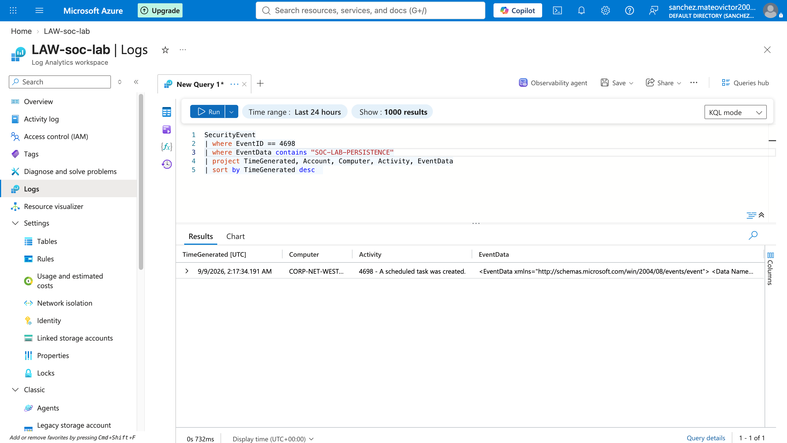

# Scheduled Task Persistence Investigation

## Detection

Windows scheduled task creation activity Event ID `4698`

## Summary

A Windows scheduled task named `SOC-LAB-PERSISTENCE` was identified through Security Event logging.

Scheduled tasks are commonly used for legitimate automation, but they can also be abused to maintain persistence on a system.

## Investigation

I reviewed Windows scheduled task creation events using Microsoft Azure Log Analytics and KQL.

The investigation included:

- Filtering for Event ID 4698.
- Searching for the scheduled task name `SOC-LAB-PERSISTENCE`.
- Reviewing the account associated with the event.
- Reviewing the affected computer.
- Reviewing the Windows activity description.
- Reviewing the scheduled task event data.

## KQL Query

```kql
SecurityEvent
| where EventID == 4698
| where EventData contains "SOC-LAB-PERSISTENCE"
| project TimeGenerated, Account, Computer, Activity, EventData
| sort by TimeGenerated desc
```

## Findings

The query returned a scheduled task creation event associated with SOC-LAB-PERSISTENCE.
The event showed the affected computer, the account associated with the event, the Windows activity description, and the scheduled task event data.



## Analyst Assessment

Scheduled tasks can be used for legitimate administration, but unexpected scheduled task creation may indicate persistence.
The activity should be reviewed to determine whether the task was expected and authorized.

## Recommended Response

Review the scheduled task name and configuration.

Identify the account associated with the task creation event.

Inspect the command or program configured to run.

Determine whether the scheduled task was expected and authorized.

Remove or disable the task if it is determined to be unauthorized.
